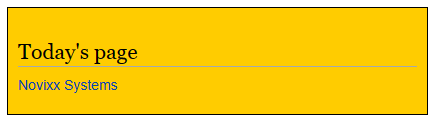

# DailyPage

DailyPage is a MediaWiki extension that allows users to view a page that is automatically updated every day. This is useful for Wikis that want to display a "Page of the Day" or "Article of the Day" on their main page.

## Installation

To install this extension, add the following to LocalSettings.php:

```php
wfLoadExtension( 'DailyPage' );
```

Note that your MediaWiki installation must use MySQL, not SQLite.

## Usage

It automatically gets put on all pages

Example of how it looks:




# License

This extension is licensed under the GNU General Public License v2.0. See the [LICENSE](LICENSE) file for more details.
